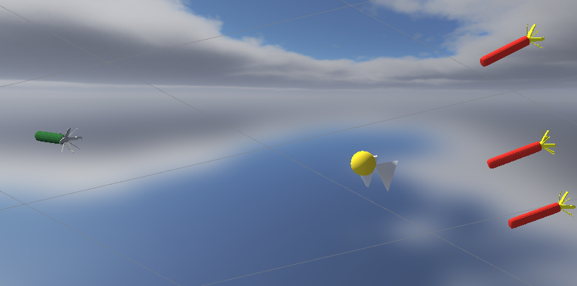
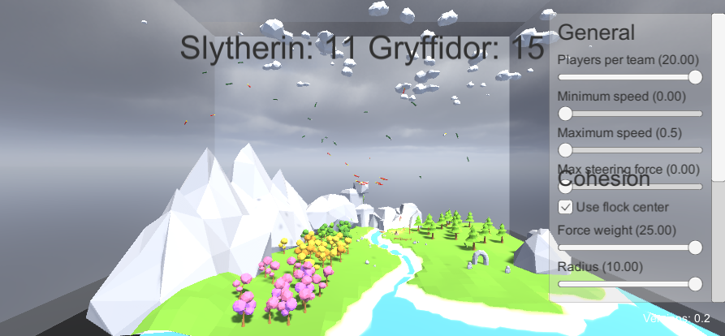
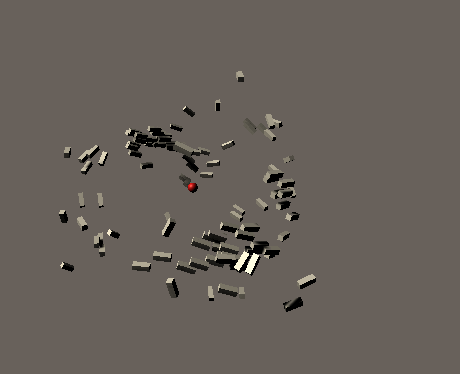
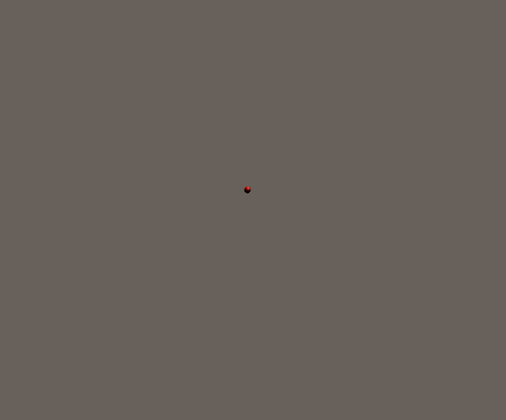
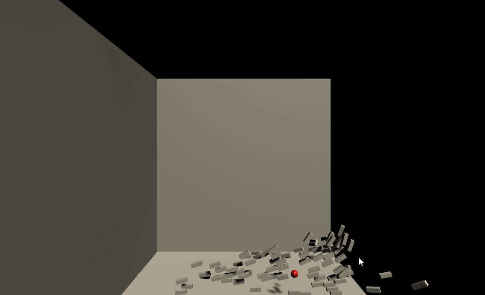

# Quidditch
This project builds upon Omar Addams' boids project and repository in order to create a simplified and Emergent-AI-based game of Quidditch,
the popular wizarding passtime in the Harry Potter Universe.
The game is simple, catch the golden snitch! Catch it for a point towards 100 and catch it on a streak for 2 points!

There are two classic rival teams: the Green/Silver Slytherins, and the Red/Gold Gryffindors.

- Each team is differentiated by a number of randomly distributed traits:
- Weight - affecting accelerations.
- Max Velocity - top speeds are clamped down to limit extreme behaviour.
- Aggressiveness - determines the chances of incapacitating another player on collision, surviving the hit yourself.
- Max Exhaustion - Players can only fly for so long before they need to take a break or risk falling out of the sky.
- Bloodthirst - Players selected as bloodthirsty will be extra motivated to go for collisions against other players.
- Skill - Players who are able to catch the snitch become better and more focussed on further scoring.

Players will roughly flock as boids, but are also drawn by other forces, such as those to avoid obstacles and chase the snitch.
Should players collide with terrain, fly too hard, or lose a collision (including a small chance of friendly fire), they are knocked out 
temporarily until they can recover, at which point they return to their spawn point and rejoin the game.

The Snitch will travels semi-randomly, avoiding players but maintaining within the playspace. 
If it is caught, it returns to it's spawn point.

***Note: for unknown Quantum-seeming reasons, if you would like the individuals of a team to have proper random attributes, 
rather than just a single sample being used across all of the members of a team, insert a break-point in the 
Flock.cs script (Found under Assets/Boids/Scripts) at line 42 (where the comment notes to), and attach VS (only tested with VS)
to Unity before running. You will have to "continue" through for the creation of each player (current default = 40 players total).***

# Below is the documentation that came with Omar Addams' repository

# Boids-Simulation
This project simulates the flocking behavior of birds. It uses Unity3d engine to implement the Boids algorithm.

Boids algorithm is an emergent-behavior approach that follows three main rules:

1) **Cohesion** force is applied to local flockmates to steer towards their average position (center of mass) => pulling them toward each other.
2) **Separation** force is applied to local flockmates to avoid crowding => pushing each other away.
3) **Alignment** force is applied to local flockmates to steer them toward the average direction => travelling in the same direction.

| Cohesion | Separation | Alignment |
| :-----: | :-------: | :-------: |
|  |  |  |

`The red sphere in the images represents the average position (center of mass) of the entire flock.`

Additional rules can be applied to the simulation, such as collision avoidance.

| Collision Avoidance |
| :-----: |
|  |

# Demo

We created a demo that simulates a flock of 50 birds.
A complete demo can be found on [https://omaddam.github.io/Boids-Simulation/](https://omaddam.github.io/Boids-Simulation/).
